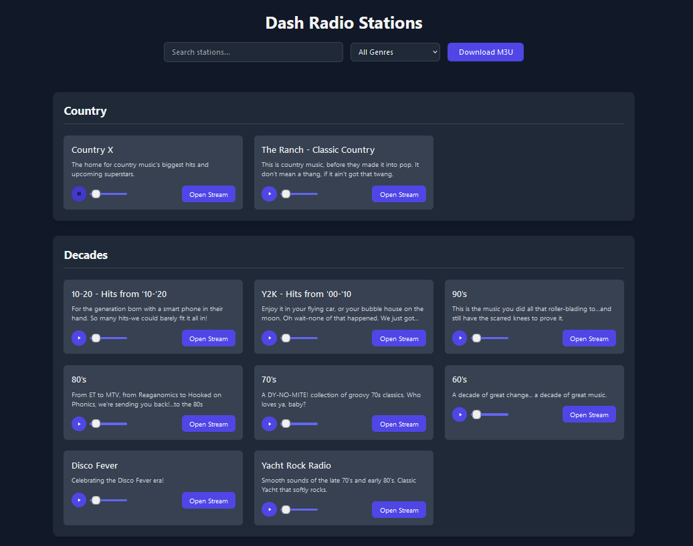

# A Simpler DashRadio

A Node.js web application that generates M3U playlists for Dash Radio [(LITT Live Music)](https://littlive.com) stations as well as providing a web interface for streaming and managing radio stations in a simple dark user friendly UX.



## Features

- 🎵 Browse and search Dash Radio stations
- 📋 Generate M3U playlists for use in media players
- 🎚️ Live preview with volume control
- 🔍 Real-time search functionality
- 📑 Filter stations by genre
- 🌙 Dark mode interface
- 📱 Responsive design for all devices

## Installation

1. Clone the repository:
```bash
git clone git@github.com:ViceBooster/dashRadio.git
cd dashRadio
```

2. Install dependencies:
```bash
npm install
```

3. Start the server:
```bash
# Development mode with auto-reload
npm run dev

# Production mode
npm start
```

The application will be available at `http://localhost:3000`

## Usage

### Web Interface

1. Visit the main page at `http://localhost:3000`
2. Use the search bar to find specific stations
3. Filter stations by genre using the dropdown
4. Click the play button to preview a station
5. Use the volume slider to adjust preview volume
6. Click "Open Stream" to open the station in a new tab

### M3U Playlist

1. Click the "Download M3U" button to download a playlist file
2. Import the M3U file into your favorite media player
3. All stations will be available in your media player's playlist

## API Endpoints

- `GET /`: Home page
- `GET /view`: Station browser interface
- `GET /playlist.m3u`: Download M3U playlist
- `GET /stream/:stationId`: Stream redirect for specific station

## Development

### Project Structure

```
dashRadio/
├── app.js           # Main application file
├── package.json     # Project dependencies
└── views/          
    ├── home.ejs    # Home page template
    ├── stations.ejs # Station browser template
    └── partials/   # EJS partial templates

```

### Technologies Used

- Express.js - Web framework
- EJS - Templating engine
- Axios - HTTP client
- Tailwind CSS - Styling
- Node.js Audio - Stream handlin
